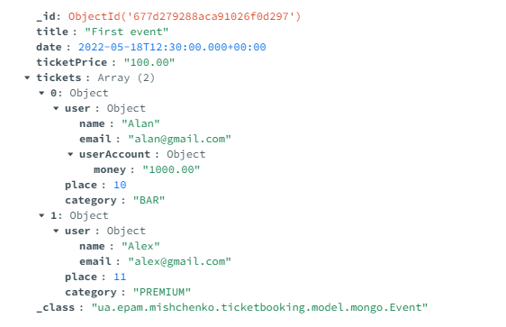
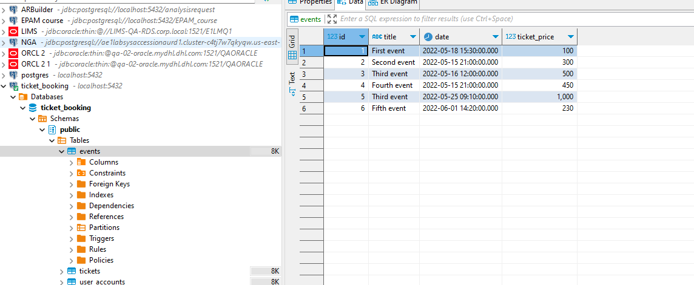
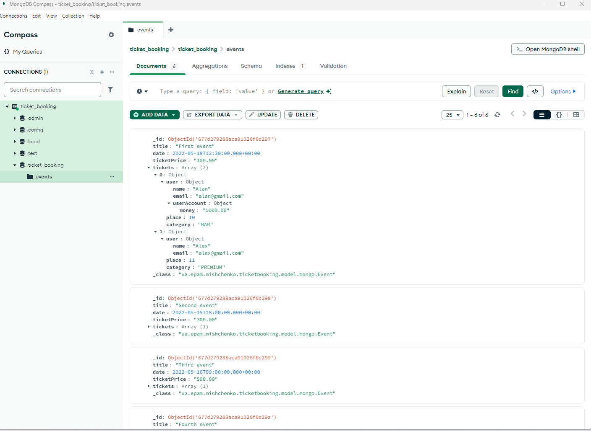

Install MongoDB and use the corresponding Java driver.

1. Define the data model for MongoDB (direct table-collection mapping is not the best idea).
You can find models under ua.epam.mishchenko.ticketbooking.model.mongo

   The 'one-to-one' and 'one-to-many' relationships are implemented as embedded documents in Mongo.
    This approach deviates from a direct table-collection mapping (which uses referenced relations in MongoDB).
    Adopting this approach might lead to duplication of users in MongoDB as they can appear in different tickets of events. 
    However, in MongoDB, such duplication is acceptable and can actually lead to faster query results as it eliminates the need for joining separate collections. 
    The id field was removed from Ticket, UserAccount, and User entities because they are part of the Event document and hence don't need separate identifiers.
2. Write data migration job (via SQL and MongoDriver operations).

At first step, I create tables on my local postgress by using database/create_tables.sql;
Then I insert data from src/test/resources/sql/insert-data.sql

Migration method in DatabaseMigrationService. It will be exacted on startup of application if properties.migration_enabled equals true.

After running migrate method then all date was migrated to MongoDb

3. Use an aggregation mechanism to get grouped results from the database.
Implemented  aggregation in UserMongoRepository and EventMongoRepository.
   TicketRepository and UserAccountRepository were not migrated since uses userId for search, but this field is not exist in MongoDb one document.